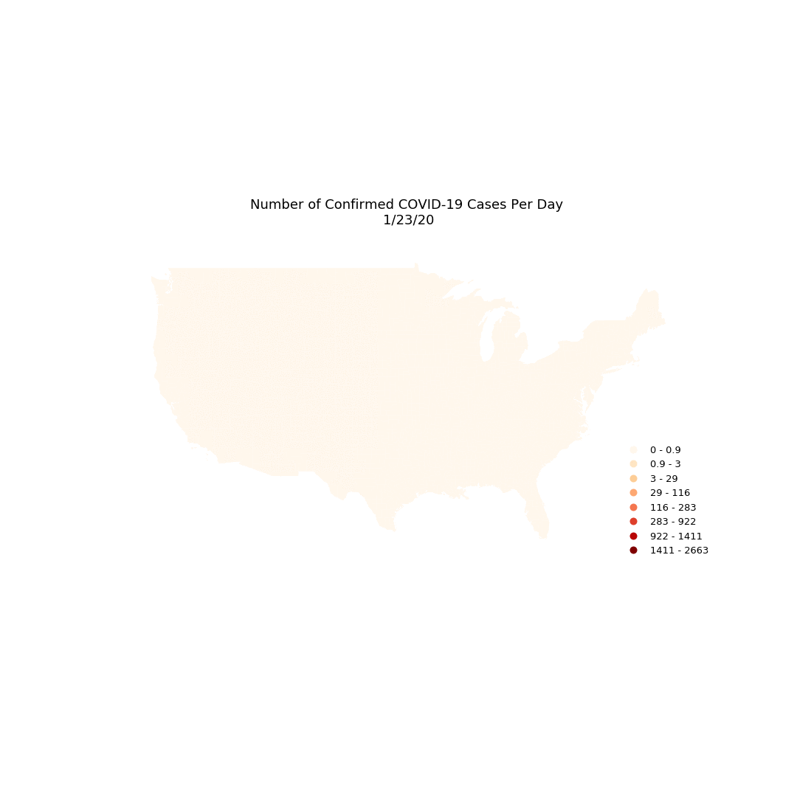
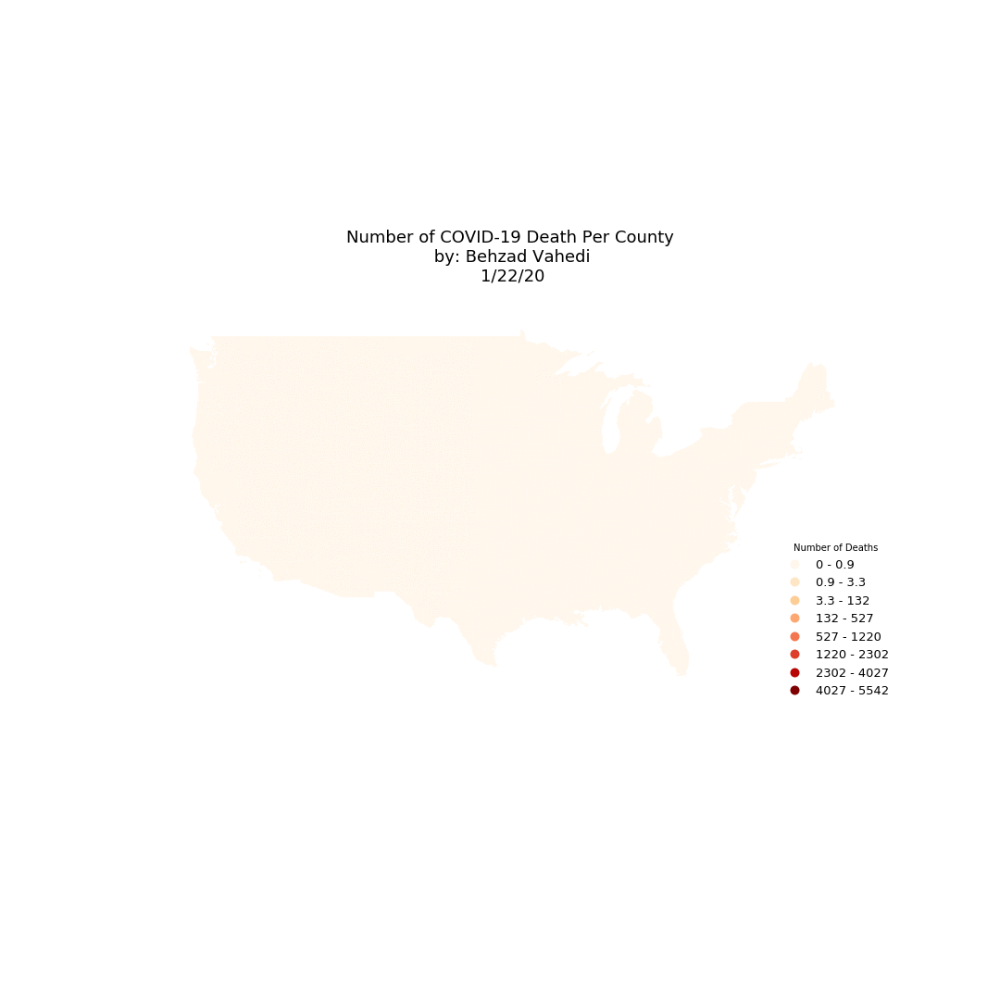

## Mapping Spatial and Temporal Patterns of COVID-19 Cases and Deaths in the Contiguous US 

This repository contains the code for mapping spatiotemporal patters of COVID-19 cases and deaths in the contiguous US and at county level. Analysis and mapping performed in Python using `geopandas` and `geoplot` libraries. The iPython notebook is available in [notebook](https://github.com/behzad-vahedi/COVID-19-visualization/tree/master/notebook) folder.  

County Level COVID-19  data are downloaded from usafacts.org on May 2nd, 2020. 

* Created by Behzad Vahedi (vahedi.behzad@gmail.com) *

### Map of Cumulative Number of COVID-19 Cases in US Counties

### Map of New COVID-19 Cases per Day

### Map of Cumulative Number of COVID-19 Deaths

